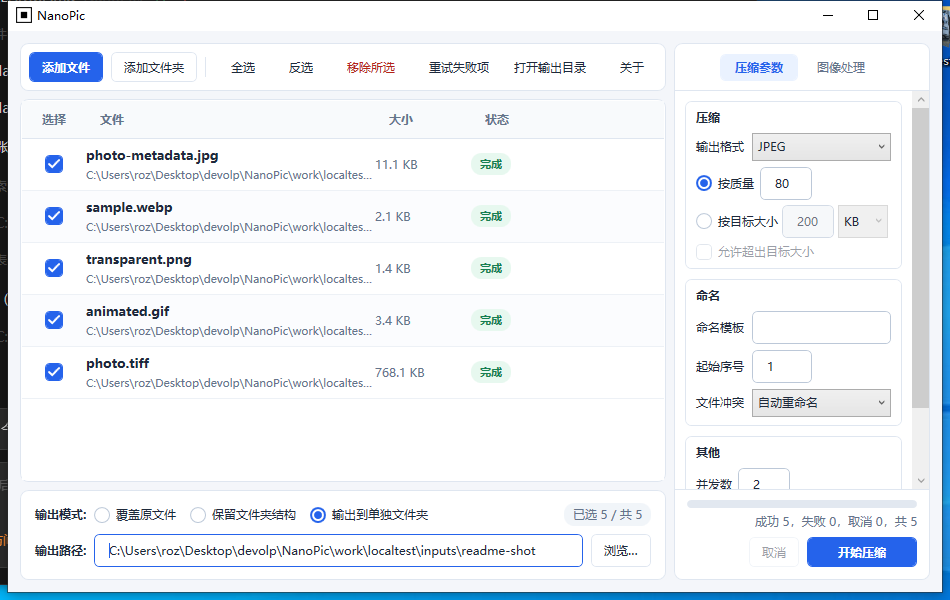

# NanoPic

**一个只有约 1.3 MB 的小工具，帮你批量压缩和转换图片。**

免安装 · 双击即用 · 图片不出电脑

[下载正式版](https://github.com/luvcamor/NanoPic/releases/latest) · [使用说明](docs/USER-GUIDE.md) · [问题反馈](https://github.com/luvcamor/NanoPic/issues)

NanoPic 是一款 Windows 上的图片压缩和转换小工具。把图片拖进去，设好想要的格式和大小，点一下开始，它就能帮你把一堆图片一次性处理好。

## 它好在哪

- **体积小**：整个软件只有一个文件，约 1.3 MB，不占地方
- **免安装**：下载解压就能用，不用装这装那，删掉也不留痕迹
- **省事**：一次能处理一大堆图片，多张同时进行，速度快
- **按质量或目标大小压缩**：JPEG/WebP 调整编码质量；PNG 优先在保持图片尺寸的情况下进行颜色量化优化；若目标体积仍无法达到，可由你选择是否缩小图片尺寸
- **智能防体积膨胀**：优化后若未减小体积将自动保留原图最佳数据，绝不越压越大
- **超大图片也能处理**：遇到超高像素的图片自动缩小，不会报错
- **放心**：图片全程在你电脑上处理，不用上传到任何网站

## 界面预览

## 能做什么

- 支持 `JPG`、`PNG`、`WEBP`、`GIF`、`BMP`、`TIFF`、`ICO` 这些常见格式
- 批量压缩、转换格式、调整尺寸
- 手机竖拍的照片自动摆正
- 加文字水印、调亮度
- 自己定义输出的文件名和存放位置
- 支持快捷键操作（如 `F5` 开始、`Esc` 取消）

## 怎么用

1. 去 [Releases](https://github.com/luvcamor/NanoPic/releases/latest) 下载 `NanoPic.exe`；如果下载的是便携压缩包，请先解压
2. 双击运行 `NanoPic.exe`
3. 把图片拖进窗口，或点「添加文件 / 打开文件夹」
4. 选好格式、大小等设置
5. 点「开始压缩」（或按 `F5`）

## 问题反馈

遇到问题欢迎到 [GitHub Issues](https://github.com/luvcamor/NanoPic/issues) 提出来，或通过程序「关于」页面里的「联系作者」入口反馈。

## 许可

本项目开源，详见 [LICENSE](LICENSE)。
